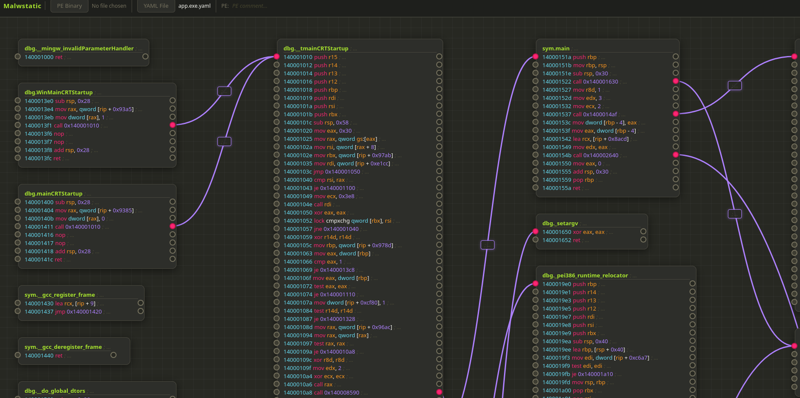

# Malwstatic

<p align="center">
  
  
  
  
  
</p>

<p align="center">
  A browser-based static analysis tool for PE binaries — powered by <strong>Rizin WASM</strong> and a visual node editor.
</p>



<p align="center">
  <a href="https://adriann17.github.io/malwstatic/>
    
  </a>
</p>

---

## Features

- **PE Binary analysis** — drag-and-drop a `.exe` and Rizin analyzes it entirely in the browser (no server required)
- **Visual call graph** — functions rendered as nodes with connections showing cross-references, built on [Drawflow](https://github.com/jerosoler/Drawflow)
- **Monokai theme** — syntax-colored offsets, opcodes, and annotations
- **Inline comments** — annotate instructions, functions, connections, and the PE itself; all saved to YAML
- **YAML export / import** — save your analysis to a `.yaml` file and reload it later; supports the [File System Access API](https://developer.mozilla.org/en-US/docs/Web/API/File_System_Access_API) for in-place saves (`Ctrl+S`)
- **Single-file build** — `bun run build` produces a self-contained `dist/index.html` with everything inlined

---

## Stack

| Layer | Technology |
|---|---|
| Runtime / Bundler | [Bun](https://bun.sh) |
| Language | TypeScript |
| Disassembler | [Rizin](https://rizin.re) (compiled to WASM) |
| Node editor | [Drawflow](https://github.com/jerosoler/Drawflow) |
| Serialization | [yaml](https://eemeli.org/yaml/) |

---

## Getting Started

### Prerequisites

- [Bun](https://bun.sh) ≥ 1.2

### Install dependencies

```bash
bun install
```

### Development

Watches `src/` and rebuilds `dist/init.js` on every change:

```bash
bun run dev
```

Then open `index.html` with any local HTTP server.

### Production build

Bundles and minifies everything into a single `dist/index.html`:

```bash
bun run build
```

The output file can be opened directly in any browser — no server needed.

---

## Usage

1. **Load a PE binary** — click **PE Binary** and select a `.exe`. Rizin analyzes it in the browser and downloads a `.yaml` file automatically.
2. **Load a YAML file** — click **YAML File** to open a previously saved analysis. Chrome/Edge use the File System Access API so `Ctrl+S` saves back to the same file; Firefox falls back to download.
3. **Annotate** — click any instruction row, function header, or connection path to add a comment. Comments are saved with the YAML.
4. **Save** — press `Ctrl+S` at any time.

---

## Project Structure

```
src/
├── init.ts                  # Entry point, event wiring
├── rizin.ts                 # Rizin WASM integration
├── utils.ts                 # UI utilities (toast)
├── drawflow.d.ts            # Drawflow type declarations
├── documentation/
│   └── documentation.ts     # Draft/commit pattern wrapper
├── export/
│   └── exportYAML.ts        # YAML export, file picker, save-to-handle
├── import/
│   └── importYAML.ts        # YAML parser → data model
├── node/
│   └── node.ts              # Drawflow node builder & connection logic
└── structure/
    ├── decompiledPE.ts       # Base data model
    └── decompiledReader.ts   # Extended model with comment fields
```

---

## Known Limitations

- The Rizin WASM module is a singleton — loading a second PE in the same session reloads the page automatically to reset the module state.
- `pdfj` (full disassembly per function) can be slow for large binaries with many functions.

---

## License

[MIT](https://opensource.org/licenses/MIT)
